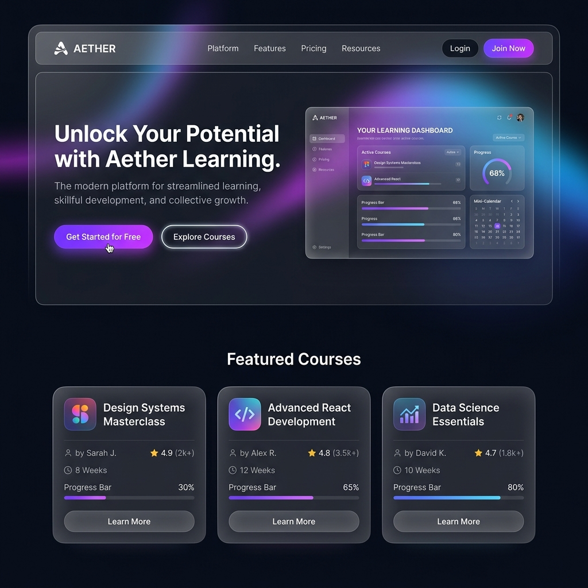
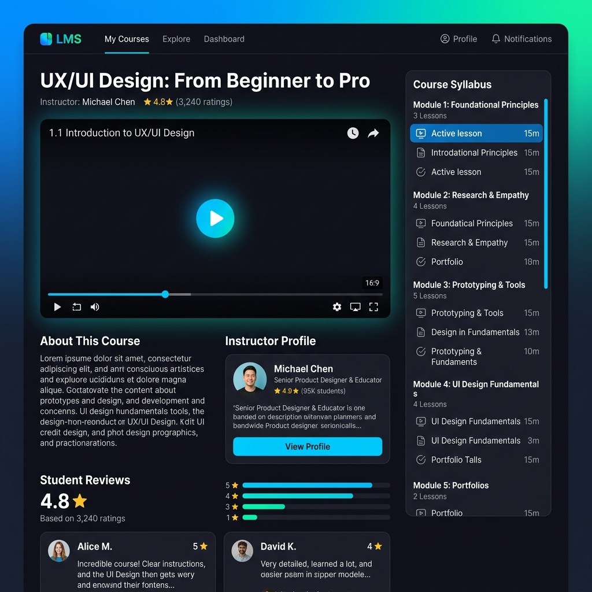
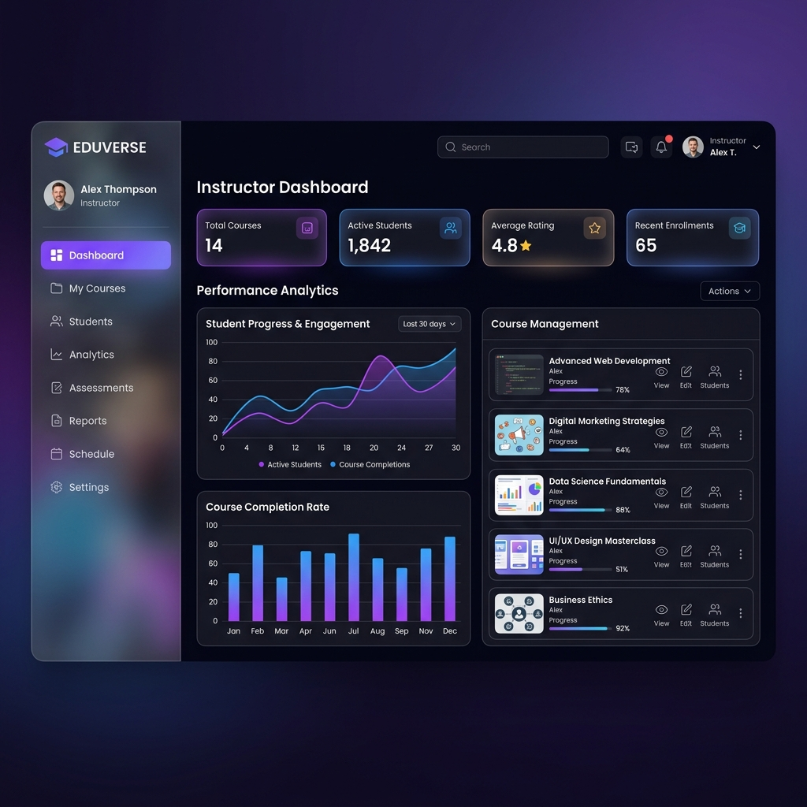

# 🎨 SkillHub LMS – Phase 2: UI Design & Design System (Revised)

Welcome to Phase 2! Before we touch React (which happens in Phase 3), we need to establish our **Design System**. A design system is a collection of reusable components, guided by clear standards, that can be assembled together to build any number of applications.

By defining our colors, typography, spacing, states, and breakpoints *now*, we ensure our UI looks consistent, premium, and professional — like Linear, Notion, or a top-tier Udemy alternative — and that Phase 3 isn't spent improvising decisions that should've been made here.

---

## 1. The Design Language

We are aiming for a **Modern, Premium, Dark-Mode-First** aesthetic.
- **Glassmorphism:** Semi-transparent backgrounds with background blur for floating elements (navbars, dropdowns).
- **Vibrant Accents:** Deep purple and neon blue to contrast against a dark, sleek background.
- **Soft Shadows & Rounded Corners:** To make the interface feel tactile and friendly despite the dark theme.

> **Performance note:** `backdrop-blur` (glassmorphism) is expensive to render on low-end mobile devices and can cause jank on scroll, especially for a sticky navbar. Test the glass navbar on a mid-range Android device before committing to it site-wide. If it stutters, fall back to a solid `--bg-secondary` background with no blur for that component only — everything else in the design language stays as-is.

---

## 2. Global Tokens (Tailwind Translation)

These design tokens will eventually be placed into our `tailwind.config.js`.

### 🎨 Color Palette
```css
/* Backgrounds */
--bg-primary: #0F172A;      /* slate-900 - Main app background */
--bg-secondary: #1E293B;    /* slate-800 - Card backgrounds */
--bg-glass: rgba(30, 41, 59, 0.7); /* For blurred navbars */

/* Accents (Primary Brand Colors) */
--brand-purple: #8B5CF6;    /* violet-500 */
--brand-blue: #3B82F6;      /* blue-500 */
--brand-gradient: linear-gradient(to right, #8B5CF6, #3B82F6);

/* Text */
--text-primary: #F8FAFC;    /* slate-50 - Headings */
--text-secondary: #94A3B8;  /* slate-400 - Body text, subtitles */
--text-muted: #64748B;      /* slate-500 - Placeholder text ONLY, not body copy */

/* Semantic/Feedback */
--success: #10B981;         /* emerald-500 - Course completed, success toasts */
--danger: #EF4444;          /* red-500 - Errors, delete actions, error toasts */
--warning: #F59E0B;         /* amber-500 - Pending, drafts, warning toasts */
--info: #3B82F6;            /* blue-500 - Informational toasts (reuses brand-blue) */
```

> **Accessibility note:** `--text-muted` (`#64748B`) on `--bg-primary` (`#0F172A`) sits close to the WCAG AA line for normal body text (4.5:1). Verify with a contrast checker before final use — treat it as **placeholder/disabled text only**, never as body copy or anything conveying required information. Use `--text-secondary` for anything a user needs to actually read.

### 📐 Spacing & Breakpoints (New)

Tailwind's default spacing scale (`4px` base unit) is used as-is — no custom overrides. Breakpoints follow Tailwind defaults so component behavior is predictable:

| Token | Width | Usage |
|---|---|---|
| `sm` | 640px | Large phones (landscape) |
| `md` | 768px | Tablets — Sidebar collapses to icon-only or drawer |
| `lg` | 1024px | Small laptops — Course grid moves to 3 columns |
| `xl` | 1280px | Desktop — Course grid moves to 4 columns |

**Layout rules:**
- **Sidebar (Dashboard):** Fixed left sidebar on `lg+`. Below `lg`, it collapses into a hamburger-triggered drawer that overlays content.
- **Course Grid:** 1 column (`<sm`) → 2 columns (`sm–lg`) → 3 columns (`lg–xl`) → 4 columns (`xl+`).
- **Video Player:** Always full-width of its container, height determined by 16:9 aspect ratio, never fixed pixel height.

### 🧱 Z-Index Scale (New)

| Token | Value | Usage |
|---|---|---|
| `z-dropdown` | 40 | Nav dropdowns, select menus |
| `z-navbar` | 50 | Sticky/glass navbar |
| `z-drawer` | 60 | Mobile sidebar drawer |
| `z-modal-backdrop` | 90 | Modal overlay background |
| `z-modal` | 100 | Modal/dialog content |
| `z-toast` | 110 | Toast notifications (always on top) |

Defining this now prevents stacking bugs once dropdowns, drawers, modals, and toasts coexist on the same page.

### ✍️ Typography
We use **Inter** (Google Fonts) for the entire application.
- **Headings (h1–h6):** `font-bold`, tight tracking (`tracking-tight`).
- **Body Text:** `font-normal`, relaxed line height (`leading-relaxed`).
- **Small Text (badges, tags):** `font-medium`, uppercase, wide tracking (`tracking-wider`).

### 🔲 Borders & Shadows
- **Border Radius:** `rounded-xl` (12px) for cards, `rounded-lg` (8px) for buttons.
- **Borders:** Subtle borders on cards to separate them from the background (`border border-slate-700/50`).
- **Shadows:** `shadow-xl` for dropdowns, `shadow-purple-500/20` for glowing accent buttons.

---

## 3. Reusable Component Specs

### Buttons

Each variant now defines **all interactive states**, not just default/hover.

1. **Primary Button**
   - Default: brand gradient background, white text.
   - Hover: glowing shadow (`shadow-purple-500/20`), scales up slightly (`hover:scale-105 transition-transform`).
   - Focus (keyboard): `focus-visible:ring-2 focus-visible:ring-violet-400 focus-visible:ring-offset-2 focus-visible:ring-offset-slate-900`.
   - Disabled: `opacity-50 cursor-not-allowed`, gradient desaturated, no hover/scale effects.
   - Loading: gradient stays, text replaced with a small spinner, button remains same width (no layout shift), `pointer-events-none`.

2. **Secondary Button**
   - Default: transparent background, subtle border (`border-slate-700`), slate-300 text.
   - Hover: background becomes `slate-800`.
   - Focus (keyboard): same `focus-visible` ring treatment as Primary.
   - Disabled: `opacity-50 cursor-not-allowed`, border unchanged, no hover.

3. **Ghost Button**
   - Default: no border, no background.
   - Hover: text lights up to `--text-primary`.
   - Focus (keyboard): **required** — since there's no visible border or background by default, add `focus-visible:underline` or a subtle `focus-visible:bg-slate-800/50` so keyboard users can locate it. This was previously undefined and would have been invisible to keyboard navigation.

> **Reduced motion:** All scale/transition effects above are wrapped in `motion-safe:` variants (e.g. `motion-safe:hover:scale-105`) so users with `prefers-reduced-motion` enabled don't get the animation.

### Course Cards
- **Container:** `bg-slate-800 rounded-xl overflow-hidden border border-slate-700/50 hover:border-violet-500/50 transition-colors`.
- **Thumbnail:** 16:9 aspect ratio image at the top. While loading, show a skeleton shimmer (see Skeleton spec below) at the same aspect ratio to prevent layout shift.
- **Content:** Title (truncated to 2 lines), Instructor Name (muted), Category badge.

### Inputs (Forms)
- **Container:** `bg-slate-900 border border-slate-700 rounded-lg`.
- **Focus State:** `focus:ring-2 focus:ring-violet-500 focus:border-transparent outline-none`.
- **Error State (New):** `border-red-500 focus:ring-red-500`, with a `text-sm text-red-400` message below the field. This maps directly to the Zod/Joi validation errors introduced in the Phase 1 backend — the frontend needs a defined way to display them.
- **Disabled State (New):** `opacity-50 cursor-not-allowed bg-slate-900/50`.

### Toast / Notification (New)
Needed for async feedback: "Enrolled successfully," "Upload failed," "Profile updated," etc.
- **Container:** `bg-slate-800 border rounded-lg shadow-xl`, border color matches variant (`border-emerald-500/50` success, `border-red-500/50` error, `border-amber-500/50` warning, `border-blue-500/50` info).
- **Position:** Fixed, top-right on desktop, top-center full-width on mobile. `z-toast` (110).
- **Behavior:** Auto-dismiss after 4s, pausable on hover, manually dismissable via an `×` button. Stack vertically with `gap-2` if multiple are shown.

### Modal / Dialog (New)
Needed for confirmations: "Delete this course?", "Unenroll from this course?"
- **Backdrop:** `bg-black/60 backdrop-blur-sm`, `z-modal-backdrop` (90). Clicking it closes the modal (unless it's a destructive-action confirmation, which should require an explicit button choice).
- **Container:** `bg-slate-800 rounded-xl border border-slate-700 shadow-xl`, `z-modal` (100), max-width `28rem`, centered.
- **Structure:** Title, body text, action row (Secondary "Cancel" + Primary or Danger-variant "Confirm") right-aligned.
- **Focus trap:** Focus moves into the modal on open and returns to the triggering element on close (standard a11y requirement for dialogs).

### Skeleton / Loading State (New)
Used anywhere content loads from the API: course grids, dashboard stats, course details.
- **Style:** `bg-slate-700/50 animate-pulse rounded-lg`, matching the shape/size of the content it replaces.
- **Rule:** Never show a blank screen or a single centered spinner for list content — always skeleton the actual layout so the page doesn't jump when data arrives.

### Empty State (New)
Used when an API call succeeds but returns zero results.
- **Structure:** Centered icon or illustration, one-line heading (`text-secondary`), optional one-line supporting text, optional action button.

### Video Player (New)
The single most complex and highest-traffic component in the app.
- **Base:** Native HTML5 `<video>` element wrapped in a custom-styled controls layer.
- **Source:** Points directly at the Cloudinary-hosted `videoUrl`.
- **States to design:**
  - **Loading/buffering:** spinner overlay on top of a dark placeholder matching the player's aspect ratio.
  - **Error:** e.g. video failed to load — show a message with a "Retry" button.
  - **Paused (idle):** show a centered play button over a dimmed frame.
- **Controls:** Custom-styled play/pause, seek bar, volume, fullscreen toggle. Match the dark theme.
- **Aspect ratio:** Locked 16:9, full width of container.

---

## 4. Page Layout Mockups

### A. Landing Page
First thing users see. Needs a strong hero section, a clear call to action, and a showcase of featured courses.



### B. Course Details Page
Where a student decides to enroll or an enrolled student consumes content. Requires the Video Player component (specified above), a clear syllabus/lesson list, and instructor details.



### C. Instructor Dashboard
Control center for course creators. Needs the responsive Sidebar (specified above), quick stats using a `<StatCard>` component, and a list of managed courses.


